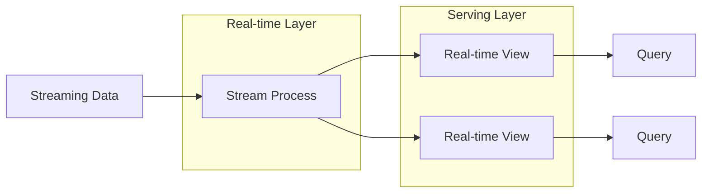
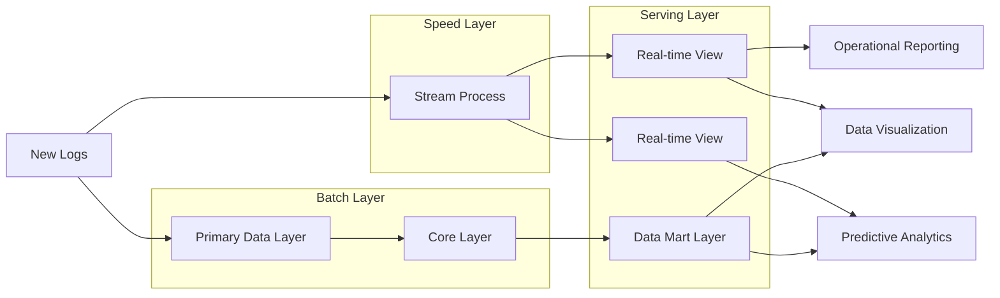

## List of content
- [Что такое Kappa ?]()
  
- [Что такое Lambda ?](https://github.com/tabarincev/de-roadmap/blob/main/concepts/data_architecture/Lambda&Kappa.md#что-такое-lambda-)
  - [Основные компоненты](https://github.com/tabarincev/de-roadmap/blob/main/concepts/data_architecture/Lambda&Kappa.md#основные-компоненты)
  - [Преимущества](https://github.com/tabarincev/de-roadmap/blob/main/concepts/data_architecture/Lambda&Kappa.md#преимущества-lambda-архитектуры)
  - [Недостатки](https://github.com/tabarincev/de-roadmap/blob/main/concepts/data_architecture/Lambda&Kappa.md#недостатки)
  - [Визуализация архитектуры](https://github.com/tabarincev/de-roadmap/blob/main/concepts/data_architecture/Lambda&Kappa.md#визуализация-lambda-архитектуры)
  - [Когда использовать ?](https://github.com/tabarincev/de-roadmap/blob/main/concepts/data_architecture/Lambda&Kappa.md#когда-использовать--1)
- [Сравнение архитектур](https://github.com/tabarincev/de-roadmap/blob/main/concepts/data_architecture/Lambda&Kappa.md#сравнение-архитектур)

# Что такое Kappa ?

## Когда использовать ?
### Сценарий

Мониторинг и управление IoT-устройствами

### Описание
`Kappa-архитектура` идеально подходит для потоковых данных, например, в системах интернета вещей (IoT), где каждое устройство генерирует огромные объемы событий:
  - Обработка потоков данных от датчиков температуры, влажности, скорости и других метрик в реальном времени.
  - Обнаружение аномалий в потоках (например, резкий рост температуры).
  - Агрегация потоковых данных для визуализации текущего состояния системы.

### Почему Kappa ?
1.	Сосредоточена на потоковой обработке, что снижает сложность архитектуры.
2.	Минимальная задержка, что критически важно для реального времени.
3.	Хорошо масштабируется для больших объемов потоковых данных без необходимости поддержки batch-слоя.

# Что такое Lambda ?
`Lambda-архитектура` — это подход к обработке больших данных, который сочетает пакетную (batch) и потоковую (streaming) обработку для достижения баланса между низкой задержкой, устойчивостью и точностью данных.

## Основные компоненты
- `Batch layer`
  - Обрабатывает большие объемы данных за длительный период времени.
  - Используется для точных и надежных расчетов (например, построения аналитических моделей).
  - Хранит всю историю данных для возможности пересчета.
- `Speed layer`
  - Обрабатывает данные в реальном времени, обеспечивая минимальные задержки.
  - Используется для оперативной аналитики, но может быть менее точным из-за отсутствия полной истории данных.
- `Serving layer`
  - Объединяет результаты `Batch` и `Speed` слоев, чтобы предоставить пользователям целостную информацию.

## Преимущества Lambda-архитектуры:
- Подходит для сложных сценариев, где важны как исторические, так и актуальные данные.
- Высокая точность благодаря `Batch` слою.
- Устойчивость к ошибкам за счет возможности пересчета данных.

## Недостатки
- Сложность разработки и поддержки из-за необходимости поддерживать два параллельных конвейера обработки.
- Более высокие затраты на ресурсы.

## Визуализация Lambda-архитектуры

## Когда использовать ?
### Сценарий
Аналитика электронной коммерции (e-commerce)

### Описание
`Lambda-архитектура` подходит для систем, где важна как историческая аналитика, так и оперативная обработка данных в реальном времени. Например, в системе электронной коммерции требуется:
  - `Batch layer`: Анализировать исторические данные о продажах, поведении клиентов, сезонности и прогнозировании спроса.
  - `Speed layer`: Реагировать на события в реальном времени, такие как:
    - Показ актуальных скидок для посетителей сайта.
    - Обработка заказов и обновление доступности товаров в реальном времени.
    - Обнаружение мошеннических операций.

### Почему Lambda ?
1.	Позволяет совмещать анализ больших объемов исторических данных с оперативной аналитикой.
2.	Обеспечивает высокую точность за счет возможности пересчета результатов в batch-слое.
3.	Сложная, но оправданная архитектура для задач с широким спектром требований.

# Сравнение архитектур
| **Аспект**                | **Lambda**                                                      | **Kappa**                                                      |
|----------------------------|-----------------------------------------------------------------|----------------------------------------------------------------|
| **Модель обработки**       | Сочетание пакетной (batch) и потоковой (streaming) обработки   | Потоковая (streaming) обработка                               |
| **Слои**                   | Batch layer, Speed layer, Serving layer                        | Unified layer (единственный слой обработки)                   |
| **Сложность**              | Высокая, из-за необходимости поддерживать две параллельные системы обработки | Умеренная, благодаря единой модели обработки                  |
| **Устойчивость к отказам** | Высокая, так как данные можно пересчитать в Batch layer         | Умеренная, требует настройки для обработки ошибок в потоке    |
| **Вариант использования**  | Приложения, где важны как исторические, так и текущие данные   | Сценарии с акцентом на потоковые данные                       |
| **Переработка данных**     | Возможна в Batch layer                                          | Требует повторного воспроизведения потока                     |
| **Задержка**               | Относительно высокая (из-за batch-компонента)                  | Низкая, практически в реальном времени                        |
| **Точность**               | Высокая, благодаря Batch layer                                 | Может варьироваться в зависимости от реализации               |
