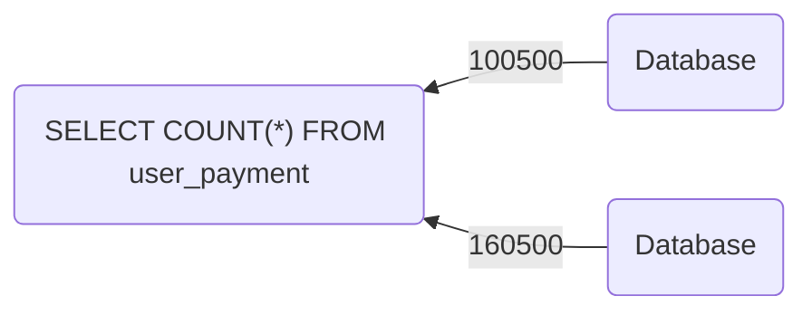

# List of content
- [Что такое CAP-теорема ?]()
  - [Consistency — Согласованность](https://github.com/tabarincev/de-roadmap/new/main/concepts/sql#consistency--согласованность)
  - [Availabilty - Доступность]()
  - [Partition Tolerance - Устойчивость]()
- [Можно ли получить все сразу (C, A, P) ?]()
  
# Что такое CAP-теорема ?
> Что означает CAP-теорема: в распределенной системе невозможно одновременно обеспечить три свойства — согласованность, доступность и устойчивость к сетевым разделениям. Можно выбрать только два из трёх

## Consistency — Согласованность
`Согласованность` — это ситуация, при которой данные данные во всех узлах системы остаются одинаковыми после выполнения изменяемой операции

После успешной записи любой клиент, обратившийся к любой реплике, должен увидеть одно и то же значение. Другими словами, Когда мы, например, производим запись в любую из реплик и мгновенно идем в другую реплику, то должны получить добавленные данные

Это и означает строгую согласованность, когда данные во всех узлах одинаковые. Она достигается за счет синхронной репликации: когда вы сделаете запись в один узел, то она не передается клиенту в статусе подтвержденной до тех пор, пока другие синхронные реплики не подтвердят эту запись. Подтверждение операции клиенту происходит только после того, как данные были записаны во все необходимые узлы

## Availabilty - Доступность
> Доступность предполагает, что любой запрос к узлу базы данных завершается откликом, однако без гарантии, что ответы всех узлов базы данных совпадают

Если нода доступна, то значит, что она отвечает корректно за какое-то приемлемое время.

Доступная система — это система, которая продолжает отвечать на запросы пользователей, даже если часть инфраструктуры испытывает проблемы.

## Partition Tolerance - Устойчивость
Устойчивость к разделению — это способность системы продолжать работу при потере связи между узлами.

Представим, что у вас есть несколько реплик и между ними происходит обрыв сети. Такая ситуация может возникнуть по разным причинам, например, реплики находятся в разных дата-центрах, между дата-центрами проехал экскаватор и перерезал кабель. Либо обе реплики находятся в одном дата-центре, но между ними потерялась сетевая связность.

Устойчивость к разделению гласит, что система должна продолжать работать, несмотря на отсутствие связности между этими репликами.

> При этом важно понимать, что сетевые разделения — это нормальная часть работы распределенных систем. Наш мир не идеален, и мы не можем полагаться на то, что сеть будет всегда работать идеально. Поэтому устойчивость к разделению, или «P» должна быть в системе всегда.

# Можно ли получить все сразу (C, A, P)?
CAP-теорема утверждает, что в распределённой системе невозможно одновременно обеспечить все три свойства.
Если происходит сетевое разделение, система вынуждена выбирать
- Либо сохранять согласованность, блокируя часть операций
- Либо сохранять доступность, не блокирую операция, но позволяя данным временно расходиться.
  
Именно этот компромисс лежит в основе архитектуры большинства распределённых систем

