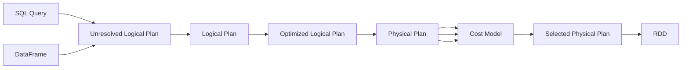

# List of content

- [Ключевые особенности Spark]()
  - [Архитектура spark-кластера]()
  - [Выполнение кода spark]()
  - [Особенности выполнения трансформаций]()
    - [Сортировки (Sorting)]()
    - [Агрегации (Aggregations)]()
    - [Соединения (Joins)]()
  - [Особенности кэширования, сериализации, чтения/записи]()
    - [Кэширование]()
    - [Сериализация/десериализация и UDF в PySpark]()
    - [Чтение/запись]()
  - [AQE]()
  - [Просмотр плана запроса и Spark UI]()
- [Список рекомендаций без погружения в контекст]()
- [Причины неоптимальной работы Spark и методы оптимизации]()
  - [Избыточное количество данных]()
    - [Оптимизации чтения]()
    - [Dynamic partition pruning]()
  - [Баланс параллельных вычислений]()
    - [Data skew]()
    - [Single Partition Calculation]()
  - [Сортировки и широкие трансформации]()
    - [Сортировки]()
    - [Излишний шафлинг]()
    - [Агрегации]()
    - [Оконные функции]()
    - [Дедупликации]()
    - [Агрегации + left-джоин vs оконные функции]()
    - [Join-операций]()

## Ключевые особенности Spark
### Архитектура spark-кластера
Spark-кластер состоит из драйвера и экзекьютеров. Драйвер оркестрирует кластером, а основные вычисления происходят на экзекьютерах, куда драйвер назначает задачи (tasks) для выполнения.

Экзекьютор, представляющий из себя инстанс JVM, содержит вычислительные слоты (ядра), которые параллельно обрабатывают куски данных (spark-partitions) в рамках tasks по указанию драйвера. Затем экзекьютор отдает информацию о выполнении обратно на драйвер. Параллелизм на spark-кластере обеспечивается экзекьюторами, слотами на экзекьюторах и spark-партициями. Нарушение параллелизма, то есть неоптимальное распределение данных по узлам кластера, ведет к медленной работе spark-приложения.

Память на экзекьюторах делится на рабочую, где выполняются основные in-memory вычисления, и storage - для различного вида кэширования.

Также экзекьюторы содержат диски. Диски используются:
- Для сохранения промежуточных данных во время широких трансформаций
- Как дополнительная память для тех операций, которым не хватило оперативной памяти
- Для дополнительного хранения кэшированных данных

Когда оперативная память переполняется и данные записываются на диск, такой процесс называется проливанием данных (spill). Любое сохранение и извлечение данных с диска - очень медленная операция. Если на диске заканчивается место, то происходит Out Of Memory (OOM) экзекьютора.

### Выполнение кода spark
На уровне кода spark делится на извлечение данных, трансформации (transformations) и действия (actions). Трансформации изменяют наборы данных, представленных в виде распределенных датасетов (RDD), путем создания новых датасетов.

Трансформации бывают двух видов - узкие (narrow) и широкие (wide). Узкие трансформации происходят в одной партиции, широкие - подразумевают перемещение данных между партициями (shuffling). Трансформации - ленивые, то есть не запускаются до тех пор, пока не применяется action.

Action запускает построение плана, причем не важно, какой интерфейс (dataframe/sql) используется для этого. Далее spark парсит код и, после логических и физических оптимизаций, порождает план выполнения (query plan, он же selected physical plan). За эти оптимизации отвечает компонент Catalyst Optimizer.



Один action может порождать несколько query, которые порождают одну или несколько job, представленных в виде spark DAG. Job в свою очередь содержит одну или несколько stage, каждая из которых делится на tasks. Количество stages зависит от количество shuffle-операций.

Task выполняется на слоте для обработки одной партиции. Партиция - это данные, то есть набор строк, физически находящиеся в одном месте. Количество tasks в stage зависит от количества партиций. Важно различать spark-партиции - разделы данных для вычислений, и hive-партиции - блоки данных с точки зрения хранения.


## Подход к решению задач
```python
users_df = (
  spark.read.table("users_table")
  .where(col("dt") == date)
  .select(..)
)

events_df = (
  spark.read.table("events_table")
  .where(col("event_type").isin("drop", "create", "put"))
  .select(..)
)

result_df = users_df.join(events_df, "user_id", "left")
```

Решение:
Во всем виноват InMemoryFileIndex - он генерирует список файлов для обработки. Проблема заключается в том что список генерируется в один поток, а NameNode часто отвечает медленно. Когда файлов немного это не является проблемой, но когда файлов много - возникают задержки. Для этого передаем задачу Listing с драйвера на отдельную джобу (Работает для сырых файлов на hdfs - ORC, JSON и тд )
Выставим параметр - spark.sql.sources.parallelDiscovery.treshold=0

Читать данные будем не из таблицы, а из директории в HDFS с множеством файлов (*), тем самым данные будут читаться параллельно. Также не забываем добавлять колонки партицирования.

Перепишем запрос

```python
users_df = spark.read.orc("dwh/ods/users/dt=2024-01-01/*")

events_df = (
  spark.read.orc("dwh/ods/events/source=drop/dt=2024-01-01/*")
  .withColumn("source", lit("drop"))
  .union(
    spark.read.orc("dwh/ods/events/source=create/dt=2024-01-01/*")
    .withColumn("source", lit("create"))
  )
  .union(
    spark.read.orc("dwh/ods/events/source=put/dt=2024-01-01/*")
    .withColumn("source", lit("put"))
  )

result = users.join(events_df, "user_id", "left")
```

Смотрим в Spark UI и видим что shuffle read 1800Gb и 800Gb, поэтому подкрутим параметр spark.sql.shuffle.partition. По дефолту 200, посчитаем необходимое количество:
Partitions = Memory / 250 (max 300)

При перекосе данных можно "посолить данные"
Смотрим обе таблицы на "перекос" по ключу
```python
statistics_df = (
  events_df
  .groupBy("user_id")
  .agg(count(lit(1)).alias("cnt")
  .orderBy(col("cnt).desc_null_last)
  .show(10)
```

При добавлении "соли" необходимо смотреть план запроса, используется ли колонка с солью (Catalyst может добавить ее после join)
Посмотреть план запроса можно в Spark UI -> SQL -> Job -> Details

